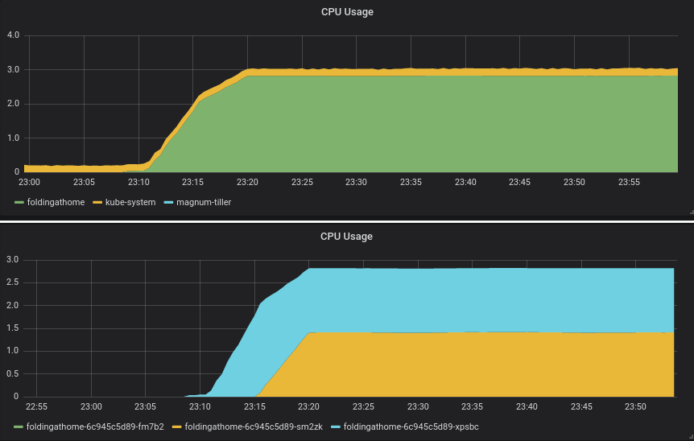

# Helm Folding@Home

A Helm Chart to deploy backfill workloads for [Folding@Home](https://foldingathome.org/).

It launches a horizontal pod autoscaler which will fill unused resources in your cluster with pods executing workloads from [Folding@Home](https://foldingathome.org/). These workloads have low priority and are pre-emptible, meaning your main workloads will have priority and can take over when you scale up.



## Setup

Check the [values.yaml](values.yaml) file for the available configuration.

The default config works, but some things you might be interested in changing:
* user and team: if you have your own values for Folding@Home
* requests and limits: the defaults assume large(ish) nodes, you might want to tune these to better fill the holes in your cluster
* gpu and smp: in case your nodes have gpus, turn them on

## Deployment

```bash
helm install . --name foldingathome --namespace foldingathome
```

You can pass values directly at installation:
```bash
helm install . --name foldingathome --namespace foldingathome --set foldingathome.team=YOURTEAM --set foldingathome.user=YOURUSER
```

## Monitoring

Check the status of the horizontal pod autoscaler:
```
$ kubectl -n foldingathome get hpa
NAME            REFERENCE                  TARGETS   MINPODS   MAXPODS    REPLICAS   AGE
foldingathome   Deployment/foldingathome   93%/90%   1         10000000   3          25m

$ kubectl -n foldingathome describe hpa
Name:                                                  foldingathome
Namespace:                                             foldingathome
Metrics:                                               ( current / target )
  resource cpu on pods  (as a percentage of request):  93% (938m) / 90%
Min replicas:                                          1
Max replicas:                                          10000000
Deployment pods:                                       3 current / 3 desired
Conditions:
  Type            Status  Reason              Message
  ----            ------  ------              -------
  AbleToScale     True    ReadyForNewScale    recommended size matches current size
  ScalingActive   True    ValidMetricFound    the HPA was able to successfully calculate a replica count from cpu resource utilization (percentage of request)
  ScalingLimited  False   DesiredWithinRange  the desired count is within the acceptable range
Events:
  Type     Reason                        Age                From                       Message
  ----     ------                        ----               ----                       -------
  Normal   SuccessfulRescale             10m                horizontal-pod-autoscaler  New size: 3; reason: cpu resource utilization (percentage of request) above target
```

Check the logs of individual pods to check the configuration loaded and job execution:
```
kubectl -n foldingathome logs foldingathome-6c945c5d89-xpsbc -f
...
22:07:57:WU00:FS00:Assigned to work server 128.252.203.4
22:07:57:WU00:FS00:Requesting new work unit for slot 00: READY cpu:4 from 128.252.203.4
22:07:57:WU00:FS00:Connecting to 128.252.203.4:8080
22:08:00:WU00:FS00:Downloading 4.36MiB
22:08:03:WU00:FS00:Download complete
22:08:03:WU00:FS00:Received Unit: id:00 state:DOWNLOAD error:NO_ERROR project:13840 run:0 clone:4301 gen:2 core:0xa7 unit:0x0000000380fccb045e6ee152e718e24f
22:08:04:WU00:FS00:Downloading core from http://cores.foldingathome.org/v7/lin/64bit/avx/Core_a7.fah
22:08:04:WU00:FS00:Connecting to cores.foldingathome.org:80
22:08:04:WU00:FS00:FahCore a7: Downloading 8.91MiB
22:08:06:WU00:FS00:FahCore a7: Download complete
22:08:06:WU00:FS00:Valid core signature
22:08:06:WU00:FS00:Unpacked 20.97MiB to cores/cores.foldingathome.org/v7/lin/64bit/avx/Core_a7.fah/FahCore_a7
22:08:06:WU00:FS00:Starting
22:08:06:WU00:FS00:Running FahCore: /usr/bin/FAHCoreWrapper //cores/cores.foldingathome.org/v7/lin/64bit/avx/Core_a7.fah/FahCore_a7 -dir 00 -suffix 01 -version 705 -lifeline 1 -checkpoint 15 -np 4
22:08:06:WU00:FS00:Started FahCore on PID 15
...
22:08:06:WU00:FS00:0xa7:Project: 13840 (Run 0, Clone 4301, Gen 2)
22:08:06:WU00:FS00:0xa7:Unit: 0x0000000380fccb045e6ee152e718e24f
22:08:06:WU00:FS00:0xa7:Reading tar file core.xml
22:08:06:WU00:FS00:0xa7:Reading tar file frame2.tpr
22:08:06:WU00:FS00:0xa7:Digital signatures verified
22:08:06:WU00:FS00:0xa7:Calling: mdrun -s frame2.tpr -o frame2.trr -x frame2.xtc -e frame2.edr -cpt 15 -nt 4
22:08:06:WU00:FS00:0xa7:Steps: first=250000 total=125000
```

## Development

Feel free to open issues or submit merge requests.
